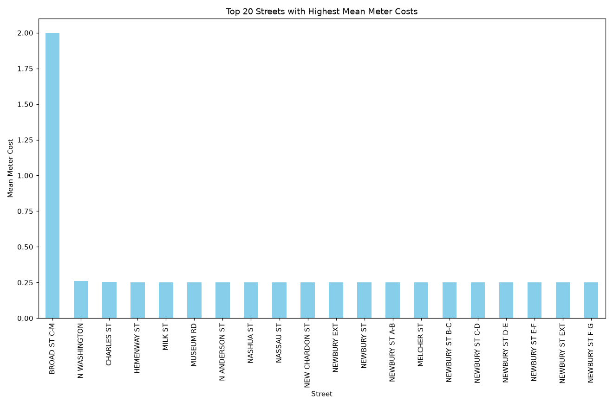
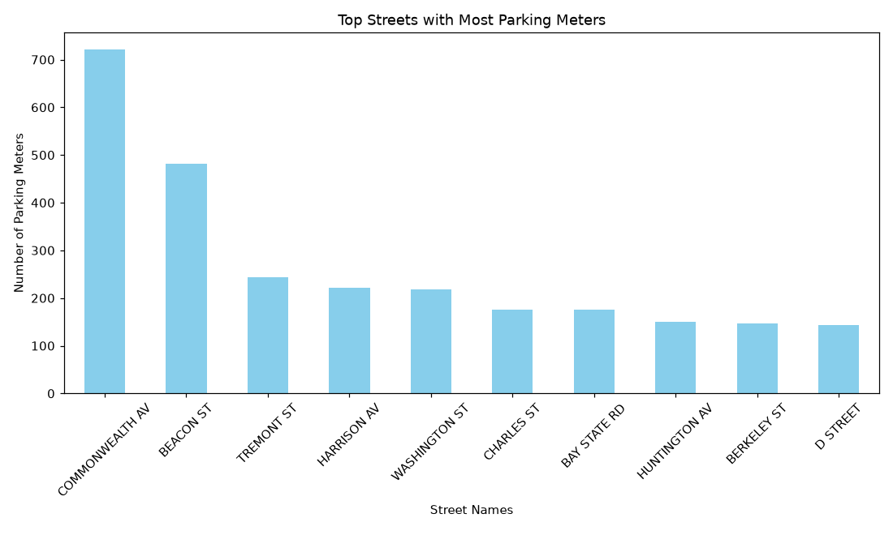

# Boston Parking Finder (SSW599 Smart Cities)

[](https://github.com/tshimbo/SSW599-SmartCities-BostonParking/actions/workflows/run.yml)

Maps every public parking meter in Boston using the city's open data, to make finding parking faster and reduce traffic from drivers circling for a spot. Built as a team project for SSW599 at Stevens Institute of Technology.

**Live map:** https://tshimbo.github.io/SSW599-SmartCities-BostonParking/Boston_Parking_Map.html

**Data source:** [Analyze Boston: Parking Meters](https://bostonopendata-boston.opendata.arcgis.com/datasets/boston::parking-meters/about)

## What it does
- `SSW599BostonParking.py` builds an interactive map (`Boston_Parking_Map.html`) with clustered markers and a popup for each meter showing its base rate and vendor
- `rate_visualizer.py` charts the 20 streets with the highest average meter rate
- `meter_count_visualizer.py` charts the streets with the most meters

## Charts



## Run it locally
```bash
pip install -r requirements.txt
python SSW599BostonParking.py      # writes Boston_Parking_Map.html
python rate_visualizer.py          # writes charts/top_streets_by_rate.png
python meter_count_visualizer.py   # writes charts/meter_count_by_street.png
```
Open `Boston_Parking_Map.html` in your browser to explore the map.

## Tech
Python, pandas, folium, matplotlib, GeoJSON
